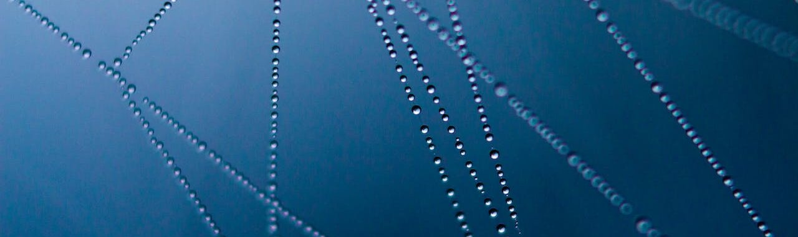

## A propos de moi,
### L'informatique et le web ont toujours suscité mon intérêt. . 
#### Après avoir terminé mes études en tant que Concepteur et Réalisateur web et Digital, j'ai réussi à trouver un emploi dans une entreprise de déstockage de mobilier en Vendée pour m'occuper du site e-commerce. À ce moment précis, j'ai pris conscience que je ne suis pas en accord avec les nouvelles technologies de notre époque. Grâce à Pôle emploi, j'ai pu m'inscrire à la formation d'intégrateur web chez Openclassroom.
De plus, je suis passionnée de photographie, donc j'ai décidé de me mettre à mon compte en micro-entreprise pour pouvoir exercer en toute confiance.

#### 📫 Comment me joindre

* Facebook: https://www.facebook.com/melanie.fauchard.98/
* Instagram: https://www.instagram.com/melaniedesmarres.photographie/
* Linkedin: https://www.linkedin.com/in/melanie-fauchard/
    

## Technologies et Langages,

  
  
  
  
  
  
  

